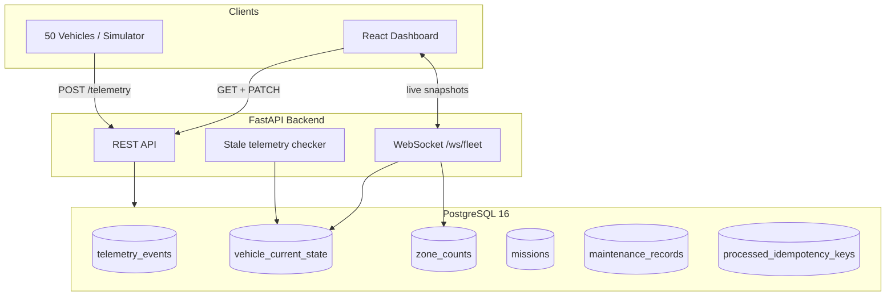
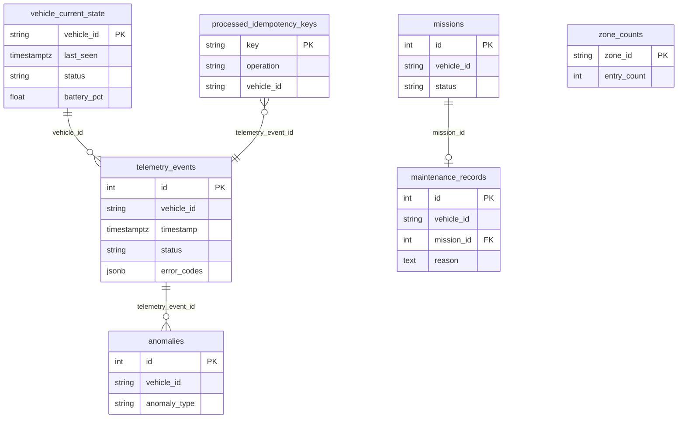
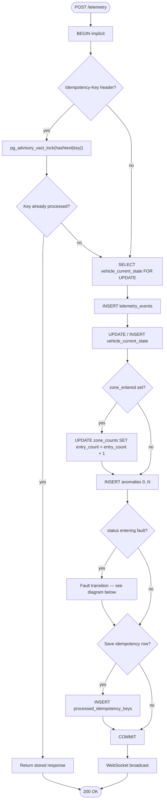
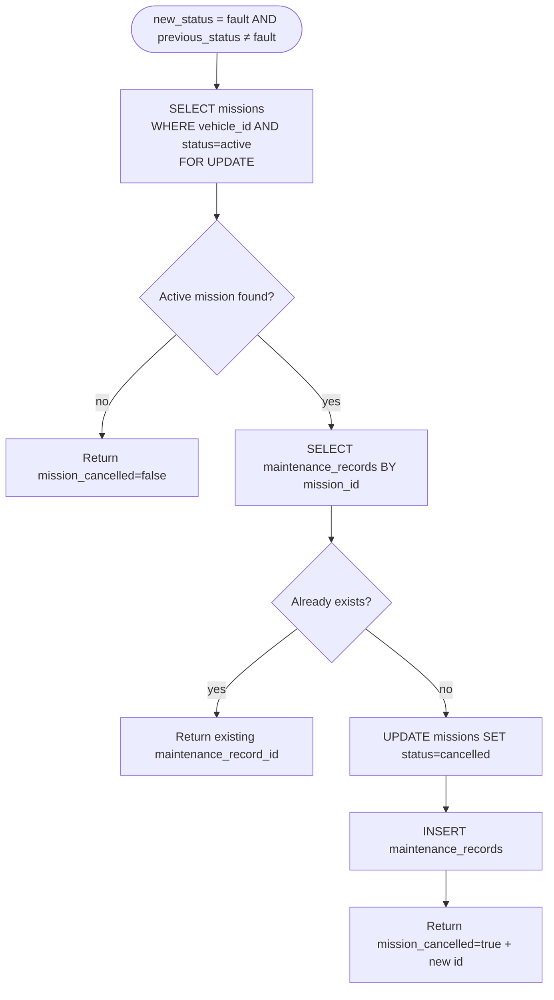
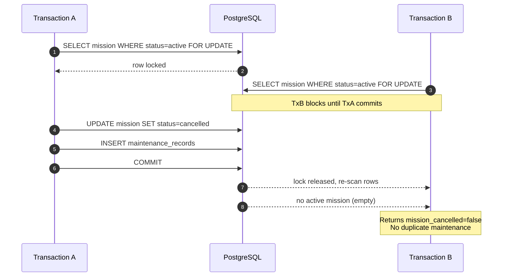
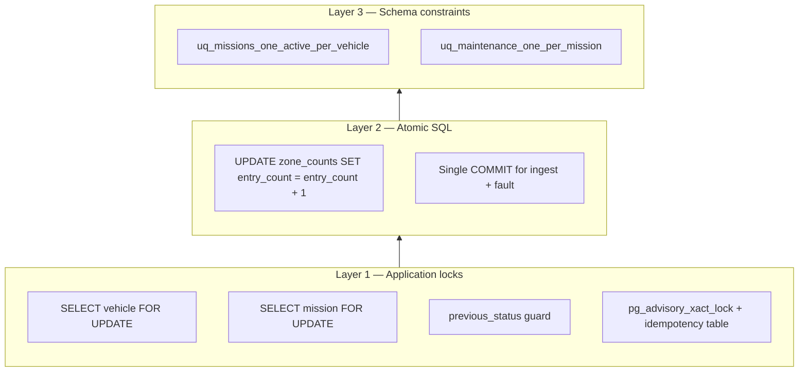
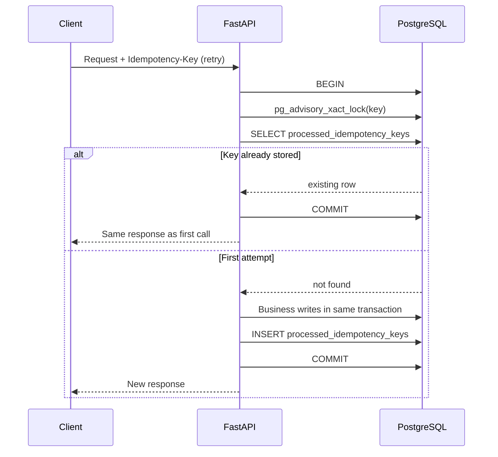
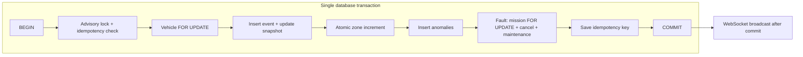

# Architecture Decision Record — Fleet Telemetry Service


## Context


Take-home project: ingest telemetry from 50 autonomous vehicles at ~1 Hz, detect anomalies, count zone entries under concurrency, handle fault transitions atomically, and expose a live dashboard.


The hardest correctness requirements are **concurrent writes** (many vehicles hitting the same zone row) and the **fault workflow** (cancel mission + create maintenance record exactly once, even under duplicate requests or race conditions). Those constraints drove the database engine choice and every SQL pattern documented below.

**Diagram index:** system architecture (Context) · data model ER (§1) · telemetry ingest flow (§2) · fault transition (§2.3) · concurrent fault sequence (§2.3) · defense-in-depth (§3) · idempotency retry (§4) · transaction boundary (§5)

### System architecture



---


## 1. Most important decisions


### PostgreSQL over SQLite (and why not an in-memory store)


**Decision:** Use **PostgreSQL 16** with **SQLAlchemy 2.0 async** + **asyncpg**.


**Why PostgreSQL specifically:**


| Requirement | Why PostgreSQL fits | Why SQLite / alternatives fall short |

|-------------|---------------------|--------------------------------------|

| Concurrent zone increments | Single-statement atomic `UPDATE … SET count = count + 1` with row-level write lock on one hot row; MVCC lets readers proceed | SQLite serializes writers; high contention on shared zone rows creates queue latency |

| Fault workflow (multi-step) | One transaction spanning `SELECT FOR UPDATE` → `UPDATE mission` → `INSERT maintenance` with **READ COMMITTED** / row locks | SQLite has DB-level write lock; harder to reason about under parallel fault events |

| Partial unique indexes | `CREATE UNIQUE INDEX … WHERE status = 'active'` — enforces “one active mission per vehicle” in the schema | SQLite added partial indexes late; semantics differ; not the target production engine for this workload |

| Advisory locks | `pg_advisory_xact_lock(hashtext(key))` for HTTP idempotency without extra infrastructure | Not available in SQLite; Redis would add another moving part for a take-home |

| JSONB for `error_codes` | Native JSONB type + GIN indexes if we scale queries | SQLite JSON is text-backed; fine for small data but weaker ecosystem |

| Timestamps with TZ | `TIMESTAMP WITH TIME ZONE` stored in UTC consistently | Doable everywhere, but Postgres + asyncpg is the default production pairing for FastAPI |

| Operational realism | Same engine used in production fleet/IoT backends: partitioning, replicas, PgBouncer | SQLite is excellent for embedded/edge, not for 50+ concurrent writers to shared counters |


**Stack details:**


- **asyncpg** — fastest asyncio driver for Postgres; non-blocking I/O matches FastAPI’s async request model.

- **SQLAlchemy 2.0 async** — generates correct SQL, supports `with_for_update()`, and keeps transaction boundaries explicit in Python without raw SQL everywhere.

- **Default isolation:** PostgreSQL `READ COMMITTED` (session default). We rely on **row-level locks** (`FOR UPDATE`) where application-level invariants need serialization, not on `SERIALIZABLE` snapshot isolation for the whole workload (lower contention).


**Local dev note:** Postgres runs in Docker (`docker compose`). Host port **5433** avoids clashing with a local Postgres/WSL instance on Windows port 5432. Inside the compose network the backend still uses `db:5432`.


**Rejected alternatives:**


- **SQLite** — correct for prototypes, but the spec explicitly stresses concurrent zone entry counting and fault atomicity; SQLite’s writer lock is the wrong default story.

- **Redis-only counters** — fast for `INCR`, but fault workflow needs relational joins (mission ↔ maintenance) and durable audit trail in the same commit as telemetry.

- **MySQL/MariaDB** — viable, but partial indexes + advisory locks + JSONB are more ergonomic in Postgres for this schema.

### Data model (relational core)



---


### `vehicle_current_state` snapshot table


**Decision:** Maintain a denormalized per-vehicle snapshot updated on every telemetry event, separate from immutable `telemetry_events`.


**Why:** Dashboard and `GET /fleet/aggregate` need fast, consistent reads without scanning millions of raw events. Aggregate fleet state is computed with:


```sql

SELECT status, COUNT(*)

FROM vehicle_current_state

GROUP BY status;

```


This is O(vehicles) regardless of telemetry volume and avoids race conditions from reading raw event streams.


---


### Single transaction for ingest invariants; WebSocket after commit


**Decision:** One DB transaction per telemetry POST covers: idempotency check → lock vehicle → insert event → update snapshot → atomic zone increment → anomaly inserts → fault transition → persist idempotency record. WebSocket broadcast happens **after** `COMMIT`.


**Why:** Partial state (e.g., zone counted but vehicle snapshot not updated) violates business invariants. Side effects (WebSocket push) are eventually consistent and must not roll back the DB if delivery fails.


---


### WebSocket for dashboard updates (with REST bootstrap)


**Decision:** Backend pushes `fleet_snapshot` every 2s over `/ws/fleet`; frontend also fetches REST on mount.


**Why:** Polling every 2s works for 50 vehicles, but WebSocket demonstrates push-based live updates with lower overhead and cleaner UX. REST remains the source of truth for initial load and external integrations.


---


## 2. SQL query catalog (what runs, why, and concurrency properties)

All write paths below share one **implicit `BEGIN`** when the SQLAlchemy session first executes SQL, and one explicit **`COMMIT`** at the end of `ingest_telemetry` / `update_vehicle_status`.

### Telemetry ingest flow (single transaction)



### 2.1 Telemetry ingest (`POST /telemetry`)


**Order of operations inside one transaction:**


#### Step A — Idempotency (optional header `Idempotency-Key`)


```sql

SELECT pg_advisory_xact_lock(hashtext(:idempotency_key));

-- transaction-scoped lock; released automatically on COMMIT/ROLLBACK


SELECT * FROM processed_idempotency_keys WHERE key = :idempotency_key;

```


If a row exists → return stored response (replay). No duplicate writes.


**Why advisory lock:** Two retries with the same key must not both pass the “key not found” check. The advisory lock serializes same-key requests; the second waits, then reads the committed idempotency row.


#### Step B — Lock vehicle snapshot row


```sql

SELECT *

FROM vehicle_current_state

WHERE vehicle_id = :vehicle_id

FOR UPDATE;

```


**Lock type:** `FOR UPDATE` (PostgreSQL row-level exclusive lock on the vehicle row).


**Why:** Prevents two concurrent ingests for the same vehicle from interleaving snapshot updates and fault detection based on stale `previous_status`. Matches the PATCH path, which already used this pattern.


If no row exists (new vehicle), insert happens without prior lock; PK on `vehicle_id` prevents duplicate inserts.


#### Step C — Append immutable event


```sql

INSERT INTO telemetry_events (

  vehicle_id, timestamp, lat, lon, battery_pct,

  speed_mps, status, error_codes, zone_entered

) VALUES (...)

RETURNING id;

```


#### Step D — Upsert snapshot (ORM update or insert on `vehicle_current_state`)


```sql

-- existing vehicle

UPDATE vehicle_current_state

SET last_seen = :ts, status = :status, battery_pct = :pct,

    speed_mps = :speed, lat = :lat, lon = :lon,

    last_zone = COALESCE(:zone, last_zone), updated_at = now()

WHERE vehicle_id = :vehicle_id;

```


#### Step E — Atomic zone counter (critical: no read-modify-write in Python)


```sql

UPDATE zone_counts

SET entry_count = entry_count + 1,

    updated_at = now()

WHERE zone_id = :zone_id;

```


**Why this shape:** The increment happens **inside the database**. PostgreSQL evaluates `entry_count + 1` on the current row value under the row lock, so 20 concurrent vehicles entering `inbound_dock_a` produce 20 correct increments — not lost updates from application-level `count = count + 1` after a `SELECT`.


**Hot row behavior:** All entries to the same zone serialize on that zone’s single row. Acceptable for 20 zones × modest entry rate; at scale see §5 (Redis/sharding).


#### Step F — Anomaly inserts


```sql

INSERT INTO anomalies (

  vehicle_id, anomaly_type, message, detected_at, telemetry_event_id

) VALUES (...);

-- one row per detected rule (low_battery, overspeed, fault_state, error_codes)

```


#### Step G — Fault transition (see §3)


Runs only when `new_status = 'fault'` AND `previous_status <> 'fault'`.


#### Step H — Persist idempotency outcome (if key provided)


```sql

INSERT INTO processed_idempotency_keys (

  key, operation, vehicle_id, telemetry_event_id,

  anomalies_detected, mission_cancelled, maintenance_record_id

) VALUES (...);

```


#### Step I — Commit


```sql

COMMIT;

```


WebSocket broadcast runs **after** this.


---


### 2.2 Manual status update (`PATCH /vehicles/{id}/status`)


Same transaction pattern, smaller scope:


```sql

SELECT pg_advisory_xact_lock(hashtext(:key));          -- optional

SELECT * FROM processed_idempotency_keys WHERE key = :key;


SELECT * FROM vehicle_current_state

WHERE vehicle_id = :vehicle_id

FOR UPDATE;


UPDATE vehicle_current_state

SET status = :new_status, updated_at = now()

WHERE vehicle_id = :vehicle_id;


-- fault transition (§3) if transitioning into fault


INSERT INTO processed_idempotency_keys (...);          -- optional

COMMIT;

```


---


### 2.3 Fault transition (`handle_fault_transition`)


This is the **most important correctness path** in the exercise.



**Application guard (fast path):**


```python

if new_status != "fault" or previous_status == "fault":

    return  # no-op: already fault or not entering fault

```


**SQL sequence when entering fault:**


```sql

-- 1) Lock the active mission row(s) for this vehicle

SELECT *

FROM missions

WHERE vehicle_id = :vehicle_id

  AND status = 'active'

FOR UPDATE;


-- 2) If no active mission → nothing to cancel (return mission_cancelled = false)


-- 3) Idempotent maintenance check (belt-and-suspenders)

SELECT *

FROM maintenance_records

WHERE mission_id = :mission_id

LIMIT 1;


-- 4) If maintenance already exists → return existing id (no duplicate)


-- 5) Cancel mission + create maintenance in same transaction

UPDATE missions

SET status = 'cancelled', cancelled_at = now()

WHERE id = :mission_id;


INSERT INTO maintenance_records (vehicle_id, mission_id, reason)

VALUES (:vehicle_id, :mission_id, :reason)

RETURNING id;

```


**Concurrent fault scenario (two requests, same vehicle, both see `previous_status = 'moving'`):**


| Time | Transaction A | Transaction B |

|------|-----------------|---------------|

| T1 | `SELECT mission … FOR UPDATE` → locks row | |

| T2 | | `SELECT mission … FOR UPDATE` → **blocks** waiting for A |

| T3 | cancel + insert maintenance | (waiting) |

| T4 | `COMMIT` → releases lock | |

| T5 | | acquires lock; mission no longer `active` → **no row returned** → no second maintenance |

**Sequence diagram (concurrent fault requests):**



**Lock type:** `FOR UPDATE` on the mission row — **pessimistic row lock**, held until transaction end.


**Why not optimistic locking (`version` column)?** Fault events are rare but must be bulletproof; a single missed retry on conflict is unacceptable for maintenance records. Pessimistic lock on the mission row is simpler and matches the spec narrative.


---


### 2.4 Read queries (dashboard / API)


#### Fleet aggregate


```sql

SELECT status, COUNT(*)

FROM vehicle_current_state

GROUP BY status;

```


#### Zone counts


```sql

SELECT zone_id, entry_count, updated_at

FROM zone_counts

ORDER BY zone_id;

```


#### Latest anomaly per vehicle (subquery join)


```sql

SELECT a.*

FROM anomalies a

INNER JOIN (

  SELECT vehicle_id, MAX(detected_at) AS max_detected_at

  FROM anomalies

  GROUP BY vehicle_id

) latest

  ON a.vehicle_id = latest.vehicle_id

 AND a.detected_at = latest.max_detected_at;

```


#### Anomaly search (filtered, paginated)


```sql

SELECT *

FROM anomalies

WHERE (:vehicle_id IS NULL OR vehicle_id = :vehicle_id)

  AND (:start IS NULL OR detected_at >= :start)

  AND (:end IS NULL OR detected_at <= :end)

ORDER BY detected_at DESC

LIMIT :limit;

```


#### Stale telemetry background task (every 5s, separate transaction)


```sql

SELECT * FROM vehicle_current_state WHERE last_seen < :cutoff;


-- dedupe check per vehicle

SELECT * FROM anomalies

WHERE vehicle_id = :vehicle_id

  AND anomaly_type = 'stale_telemetry'

  AND detected_at >= :cutoff

LIMIT 1;


INSERT INTO anomalies (...)  -- if not already flagged recently

```


---


## 3. Database constraints (safety net under the application)


Application locks are the primary mechanism; **partial unique indexes** enforce invariants even if application logic regresses.


Created at startup via `ensure_db_constraints()` (`CREATE UNIQUE INDEX IF NOT EXISTS …`):


```sql

-- At most one ACTIVE mission per vehicle

CREATE UNIQUE INDEX uq_missions_one_active_per_vehicle

ON missions (vehicle_id)

WHERE status = 'active';


-- At most one maintenance record per cancelled mission

CREATE UNIQUE INDEX uq_maintenance_one_per_mission

ON maintenance_records (mission_id)

WHERE mission_id IS NOT NULL;

```


| Constraint | Prevents |

|------------|----------|

| `uq_missions_one_active_per_vehicle` | Two concurrent `active` missions for `v-06` |

| `uq_maintenance_one_per_mission` | Double maintenance record if two fault handlers slip through |


These are **partial** (filtered) unique indexes — a vehicle may have many historical `cancelled` missions, but only one `active`.

### Defense-in-depth layers



---


## 4. Idempotency for HTTP retries

**Decision:** Optional header `Idempotency-Key` on `POST /telemetry` and `PATCH /vehicles/{id}/status`.



**Mechanism (Postgres-specific):**


1. `pg_advisory_xact_lock(hashtext(key))` — serializes concurrent requests with the same key within the transaction.

2. Lookup in `processed_idempotency_keys` — if found, replay stored response without re-running side effects.

3. On success, insert key + outcome in the **same transaction** as the business writes.


**Why not only rely on fault locks:** Idempotency covers the **entire request** (telemetry event row, zone increment, anomalies), not just fault. A network retry without idempotency would double-count zone entries even if fault handling were correct.


**Validation rules:**


- Same key cannot be reused across different operations (`telemetry` vs `status_update`).

- Status PATCH key must match the same `vehicle_id` in the path.


---


## 5. Transaction boundary diagram

Equivalent view of §2 ingest flow:



---


## 6. Unclear spec assumptions


| Ambiguity | Assumption |

|-----------|------------|

| Mission lifecycle | Each vehicle starts with one `active` mission at seed time. New missions after completion are out of scope. |

| Fault transition trigger | Fault workflow runs on telemetry with `status=fault` **or** explicit `PATCH /vehicles/{id}/status` to fault, only on first transition (`previous_status <> 'fault'`). |

| Idempotency | Optional `Idempotency-Key` header; replays are safe for retries, not required for normal clients. |

| Anomaly deduplication | Each qualifying event creates anomaly rows (no dedup window except stale telemetry, which dedupes within 10s). |

| Stale telemetry | Background task every 5s flags vehicles with `last_seen` > 10s ago. |

| Vehicle IDs | Fixed set `v-01` … `v-50` seeded at startup. Unknown IDs on ingest are accepted (fleet may grow). |

| Time zones | All timestamps stored and compared in UTC (`TIMESTAMPTZ`). |


### Anomaly definitions


| Type | Rule |

|------|------|

| `low_battery` | `battery_pct < 15` |

| `overspeed` | `speed_mps > 5` |

| `fault_state` | `status == fault` |

| `error_codes` | `len(error_codes) > 0` |

| `stale_telemetry` | No update for > 10 seconds (background checker) |


---


## 7. What changes at scale


**"Significantly" = 500+ vehicles, 10+ events/sec sustained, multi-region deployment.**


| Area | Change |

|------|--------|

| Ingest | Kafka/NATS queue; dedicated ingest workers; mandatory idempotency keys on events |

| Database | Partition `telemetry_events` by time; read replicas for dashboard; connection pooling (PgBouncer) |

| Zone counters | Redis `INCR` or sharded counters if Postgres hot-row contention on `zone_counts` appears |

| Aggregates | Materialized views or Redis cache refreshed on write |

| Stale detection | Stream processing (Flink) instead of polling loop |

| WebSocket | Horizontal scale via Redis pub/sub fan-out |

| Fault workflow | Outbox pattern for maintenance notifications to external CMMS |


---


## 8. Deliberately left out


- **Auth / RBAC** — not requested; would add JWT or API keys in production.

- **Zone geometry** — spec says edge clients populate `zone_entered`; no geofencing logic.

- **Mission assignment UI** — only cancel-on-fault is implemented.

- **Historical analytics / replay** — raw events stored but no time-series charts.

- **Unit/integration tests** — CI runs lint + build (GitHub Actions); dedicated test suite would be next step.

- **Full observability** — no Prometheus/Grafana; `/health` only.

- **Alembic migrations** — schema created via `create_all` + idempotent index DDL at startup; production would use versioned migrations.


---


## 9. Code map (SQL-related modules)


| Module | Responsibility |

|--------|----------------|

| `app/services/ingest.py` | Transaction orchestration, `FOR UPDATE` on vehicle, idempotency integration |

| `app/services/telemetry.py` | Atomic zone increment, fault transition SQL, fleet aggregate queries |

| `app/services/idempotency.py` | `pg_advisory_xact_lock`, replay helpers |

| `app/db/constraints.py` | Partial unique index DDL at startup |

| `app/models/__init__.py` | Table definitions + SQLAlchemy `Index(…, postgresql_where=…)` |


